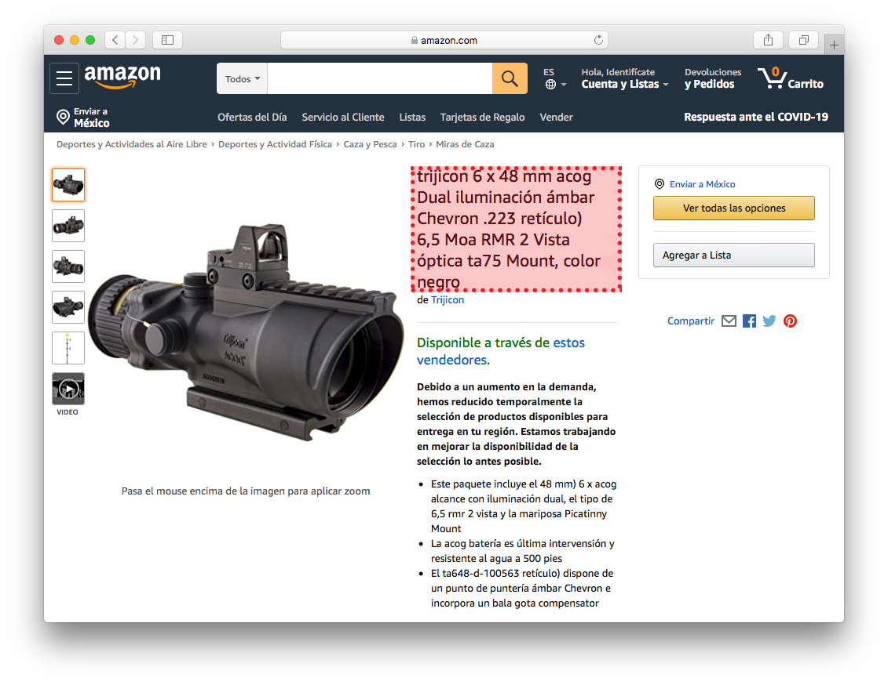
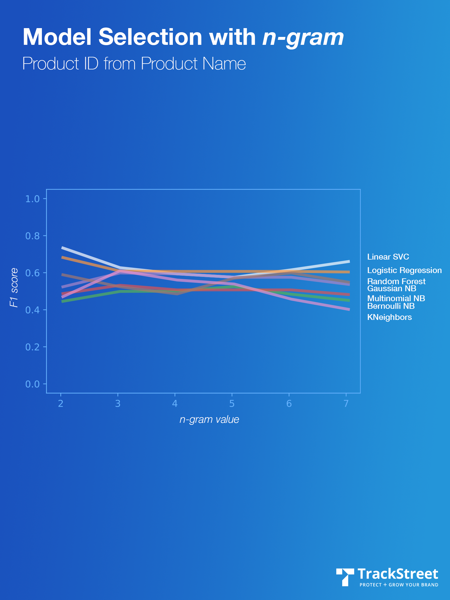
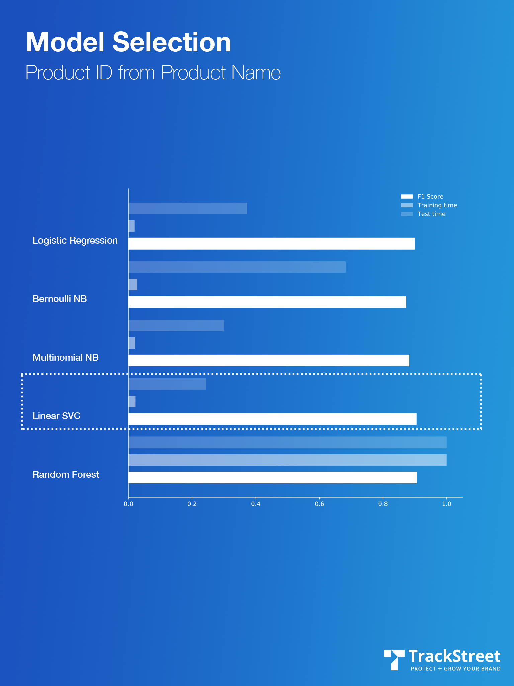
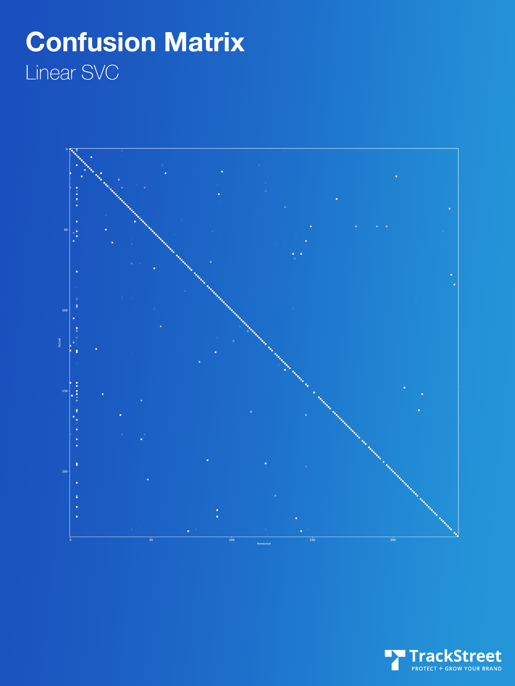
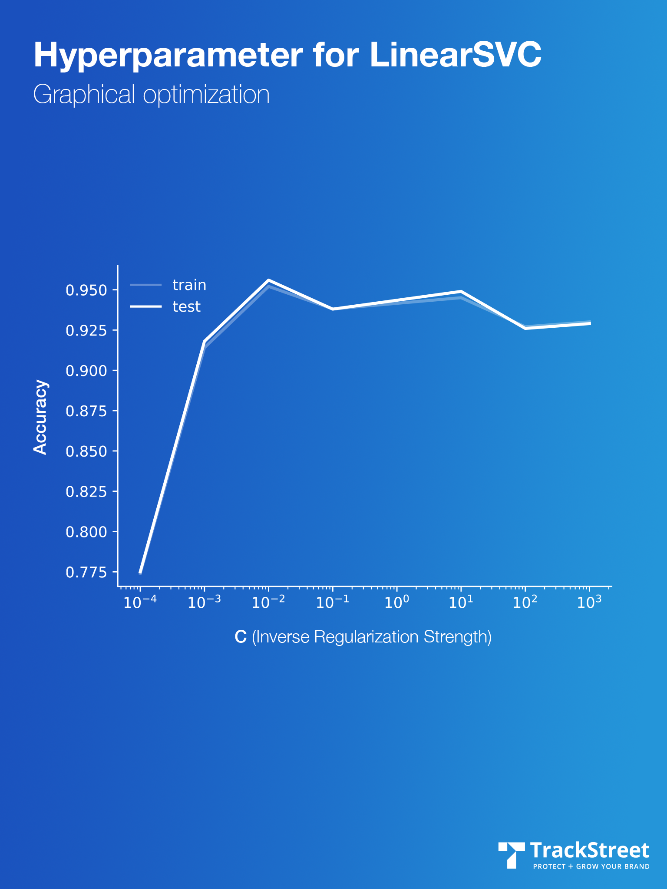
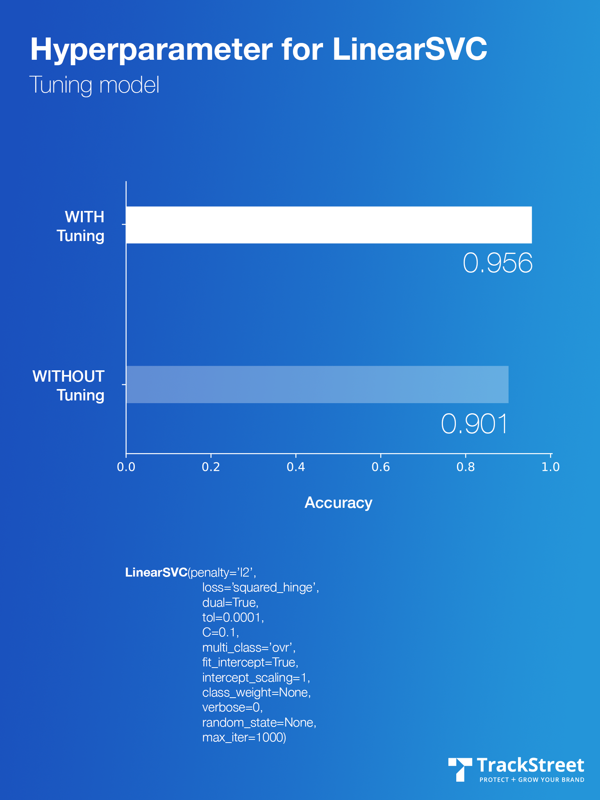

# DATA-POP Alliance - Code example

[TrackStreet](https://www.trackstreet.com) has built an industry leading *SaaS* platform that leverages the power of artificial intelligence and automation to radically reduce brand and pricing policy violations. 


In order to achieve this, a series of web crawlers were set up to download the information of different products featured in a series of online stores (BestBuy, Amazon, Target, ...), and analyze their name, description, price and image. In order to know if a product belonged to one of the clients, in **my role as a Data Scientist**, I was commissioned to solve a supervised text classification problem, with the goal of working out which supervised machine learning methods were best suited to solve it.

### Problems that were solved

* Finding a way to choose between ML models (different model types, tuning parameters, and features) to *predict* **Product ID** from **Product Name**.
* Applying a **Model Evaluation Procedure** to estimate how well a model will generalize to *out-of-sample* data.
* Choosing and fine tuning a **Model Evaluation Metric** to quantify the model performance.

### Review of the ML Metrics

* **Model evaluation procedure**: K-fold cross-validation
* **Model evaluation metrics**: F1 Score

### Workflow

1. [Reading a text-based dataset](#1-reading-a-text-based-dataset)
2. [Dataset preparation and pre-processing](#2-dataset-preparation-and-pre-processing)
3. [Choosing *n-gram* or *n-char* approximation for vectorize](#3-choosing-n-gram-or-n-char-approximation-for-vectorize)
4. [Building and comparing models](#4-building-and-comparing-models)
5. [Optimizing the model (improving hyperparameters)](#5-optimizing-the-model-improving-hyperparameters)
6. [Building the *TextPredictorEngine class* and a cron job for training](#6-building-the-TextPredictorEngine-class-and-a-cron-job-for-training)


## Hands On

### 1. Reading a text-based dataset

One of the goals of the TrackStreet Web Crawlers is to download the name of the products found on a certain web site, for example:



In the previous example the following **Product Name**  was found; while the objective of the overall model is to predict the **Product ID**.

Product Name (*X*) | Product ID (*Y*)
--- | --- 
trijicon 6 x 48 mm acog | **UNKNOWN**


An excerpt of the used *training data* is shown below:

Product Name (*X*) | UPC | Product ID (*Y*)
--- | --- | ---
Trijicon ACOG | 658010111379 | 4
Trijicon ACOG 6x48mm Chevron | 658010111546 | 4
Trijicon 6X48 acog. TA648-50G | 658010111249 | 4
Ultimate Flora Women's Care Probiotic 15 Billion | 631257158789 | 52
Renew Life Women's Care Ultimate Flora Probiotic | 658010111379 | 52
Ultimate Flora Probiotic 15 Billion | 658012531373 | 52
Renew Life Everyday Ultimate Flora Probiotic | 631257158772 | 52

### 2. Dataset preparation and pre-processing

First, duplicated values were removed.


```python

def clean_duplicated_data(self, df):
    df['is_duplicated'] = df.duplicated(['X'])    
    return df.loc[df['is_duplicated'] == False]

```


Second, as we see from the *training data*, we are faced with a non-classical text processing problem, therefore we do not follow the recommendations made by regular analysis of scientific texts to attack this type of problem. For example, one of the most common recommendations is to remove numbers; in this case, however, it doesn't make much sense because numbers are a significant identifier of the product.

Instead, the following steps were implemented:


* Converting to lower case
* Removing punctuation signs
* Removing stop words
* Removing the 10 most common words inside the data set
* Removing the 10 most rare words inside the data set

Product Name (*X*) | Pre-processed Product Name (*X'*)
--- | --- 
The Trijicon, 6 x 48 mm ACOG. TA648-50G | trijicon 6 x 48 mm acog ta648 50g


```python

def pre_processing_data(self, X,common_freq_count=10,rare_freq_count=10):
    # Lower Case
    X = X.apply(lambda x: " ".join(x.lower() for x in x.split()))
    print(type(X))
    # Removing Punctuation
    X = X.str.replace('[^\w\s]','')
    # Removing Stop Words
    X = X.apply(lambda x: " ".join(x for x in x.split() if x not in stop))
    # Common Word Removal
    common_freq = pd.Series(' '.join(X).split()).value_counts()[:common_freq_count]
    common_freq = list(common_freq.index)
    X = X.apply(lambda x: " ".join(x for x in x.split() if x not in common_freq))
    # Rare words Removal
    rare_freq = pd.Series(' '.join(X).split()).value_counts()[-rare_freq_count:]
    rare_freq = list(rare_freq.index)
    X = X.apply(lambda x: " ".join(x for x in x.split() if x not in rare_freq))
    
    return X
```


### 3. Choosing *n-gram* or *n-char* approximation for vectorize

In this step, raw text data was transformed into feature vectors and new features were created using the existing dataset. The following ideas were implemented in order to obtain relevant features from our dataset.

* Count Vectors as features
* TF-IDF Vectors as features
    * Word level
    * N-Gram level
    * Character level (n-char)

**Count Vectors as features**

Count Vector is a matrix notation of the dataset in which every row represents a document from the corpus, every column represents a term from the corpus, and every cell represents the frequency count of a particular term in a particular document.

```python
def transform_to_count_vectors(self,X):
    count_vect = CountVectorizer(analyzer='word', token_pattern=r'\w{1,}')
    return count_vect.fit(X)
```


**TF-IDF Vectors as features**

TF-IDF score represents the relative importance of a term in the document and the entire corpus. TF-IDF score is composed by two terms: the first computes the normalized Term Frequency (TF), the second term is the Inverse Document Frequency (IDF), computed as the logarithm of the number of the documents in the corpus divided by the number of documents where the specific term appears. TF-IDF Vectors can be generated at different levels of input tokens (words, characters, n-grams).


* Word level: Matrix representing TF-IDF scores of every term in different documents

Product Name (*X*) | Tokenized Product Name (*X'*)
--- | --- 
trijicon 6 x 48 mm acog | trijicon,6,x,48,mm,acog

* N-Gram level: N-grams are the combination of N terms together. Matrix representing TF-IDF scores of N-grams

Product Name (*X*) | Tokenized Product Name (*X'*, N=2)
--- | --- 
trijicon 6 x 48 mm acog | trijicon 6,6 x,x 48,48 mm,mm acog

* Character level (n-char): Matrix representing TF-IDF scores of character level n-grams in the corpus

Product Name (*X*) | Tokenized Product Name (*X'*, N=3)
--- | --- 
trijicon 6 x 48 mm acog | tri,rij,iji,jic,ico,con,on ,n 6, 6 ,6  x, x ,x 4, 48,48 , mm,mm ,m a, ac,aco,cog


```python


def vectorize(self, X, level = 'nchar'):

    min_df, max_df = self.select_tfidf_params(X)

    try:
        if level == 'word':
            # Word level TF-IDF
            self.tfidf = TfidfVectorizer(analyzer='word', token_pattern=r'\w{1,}', min_df=min_df, max_df=max_df, sublinear_tf=True, norm='l2', encoding='latin-1',max_features=5000, stop_words='english')

        elif level == 'ngram':
            # N-gram level TF-IDF
            self.tfidf = TfidfVectorizer(analyzer='word', token_pattern=r'\w{1,}', min_df=min_df, max_df=max_df, sublinear_tf=True, norm='l2', encoding='latin-1',ngram_range=(2,3), max_features=5000, stop_words='english')

        elif level == 'nchar':
            # N-char TF-IDF
            self.tfidf = TfidfVectorizer(analyzer='char', token_pattern=r'\w{1,}', min_df=min_df, max_df=max_df, sublinear_tf=True, norm='l2', encoding='latin-1',ngram_range=(2,3), max_features=5000, stop_words='english')

        X = self.tfidf.fit_transform(X).toarray()
    
    
    except ValueError:
        self.tfidf = TfidfVectorizer(sublinear_tf=True, min_df=0.1, max_df=0.5, norm='l2', encoding='latin-1',
                                         ngram_range=(1, 2),
                                         stop_words='english')
        X = self.tfidf.fit_transform(X).toarray()
    return X

```


The **best** result was obtained using a **value of 5 in the *n-char* level** as shown in the following graphs:





### 4. Building and comparing models

The next step was to train and compare different classifiers using the features created in the previous step. The following classifiers were used:

* Logistic Regression
* Random Forest
* Bagging
* Ada Boost
* Gradient Boosting
* Linear SVC
* Multinomial Naïve Bayes
* Gaussian Naïve Bayes
* Bernoulli Naïve Bayes
* Support Vector Machine


 The following functions are *utility functions* which can be used to train a model (the full script can be found at [code/rating_engine.py](https://github.com/santuario/umba-example/blob/master/code/rating_engine.py)). It accepts the classifier (estimador), the feature vector of training data (**X**) and labels of training data (**y**) as inputs. Using these inputs, the model is trained and the *accuracy score* is computed using a custom F1 multilabel score.

 ```python

def f1_multilabel(self, estimador, X, y):
        preds = estimador.predict(X)
        return f1_score(y, preds, average="micro")

def evaluate_model(self, estimador, X, y):
        resultados_estimador = cross_validate(estimador, X, y,
                     scoring=self.f1_multilabel, n_jobs=-1, cv=self.folds, return_train_score=True, return_estimator=True)
        return resultados_estimador
```

The evaluation values can be known using the function [``` def get_results```](https://github.com/santuario/umba-example/blob/b876a8e4b47b19d2aa0b9367d9db2fdaacfaf3a0/code/rating_engine.py#L180)

 ```python

def get_results():

```

This function returns a table with the respective values **Fit Time**, **Score Time**, **Test Score** and **Train Score** of each classifier, an example can be seen below:

Classifier | fit_time | score_time | test_score | train_score
--- | ---  | --- | --- | ---  
LogisticRegression | 178.059815  | 11.571758 | 0.440469 | 0.635866 
RandomForestClassifier | 138.679052  | 2.925852 | 0.426903 | 0.810615 

The model **Linear SVC** was choosen because it had the highest F1 Score and shortest training time as shown in the following graph:



The **Confusion Matrix** of the selected model **Linear SVC** was calculated using the function [``` def make_plot_confusion_matrix```](https://github.com/santuario/umba-example/blob/0b34bb64dce40035530904fe830c738004d1c6d8/code/rating_engine.py#L192) and can be seen below.

 ```python

def make_plot_confusion_matrix(self,conf_mat,
                          hide_spines=False,
                          hide_ticks=False,
                          figsize=None,
                          cmap=None,
                          colorbar=False,
                          show_absolute=True,
                          show_normed=False,
                              show_text=True,
                              normed_type="precision"):

```




### 5. Optimizing the model (improving hyperparameters)


In order to optimize our classifier model, a *grid search* was made to find the best combination of values ​​for the hyperparameters using the function [``` def find_bestEstimator_SVC```](https://github.com/santuario/umba-example/blob/3fe029c1059414c04b0d0380eb6413341fcc60f3/code/nchar_predictor.py#L191):

```python
def find_bestEstimator_SVC(self):
```


In the case of the *Inverse Regularization Strength* value, the following graph shows the advantage of optimizing hyperparameters:



The best hyperparameter values ​​found for our model are shown below:




### 6. Building the *TextPredictorEngine class* and a cron job for training

Every two weeks, a *cron job* is in charge of training a new model using the latest data collected by the web crawler. The [code/nchar_predictor.py](https://github.com/santuario/umba-example/blob/master/code/nchar_predictor.py) script, which is in charge of doing so, follows the following procedure:

Step | Function
--- | ---
Read Data | [``` def set_X_Y ```](https://github.com/santuario/umba-example/blob/3fe029c1059414c04b0d0380eb6413341fcc60f3/code/nchar_predictor.py#L79)
Process Data | [``` def transform_input ```](https://github.com/santuario/umba-example/blob/3fe029c1059414c04b0d0380eb6413341fcc60f3/code/nchar_predictor.py#L91)
Vectorize Data | [``` def vectorize ```](https://github.com/santuario/umba-example/blob/3fe029c1059414c04b0d0380eb6413341fcc60f3/code/nchar_predictor.py#L123)
Remove Outliers | [``` def remove_outliers```](https://github.com/santuario/umba-example/blob/3fe029c1059414c04b0d0380eb6413341fcc60f3/code/nchar_predictor.py#L182)
Select Hyperparameters | [``` def find_bestEstimator_SVC```](https://github.com/santuario/umba-example/blob/3fe029c1059414c04b0d0380eb6413341fcc60f3/code/nchar_predictor.py#L191)
Train the model | [``` def do_training```](https://github.com/santuario/umba-example/blob/3fe029c1059414c04b0d0380eb6413341fcc60f3/code/nchar_predictor.py#L71)
Make Predictions | [``` def predict```](https://github.com/santuario/umba-example/blob/3fe029c1059414c04b0d0380eb6413341fcc60f3/code/nchar_predictor.py#L203)


For the production enviroment, the script was tested using *unittest* procedures than can be found at [code/test_product.py](https://github.com/santuario/umba-example/blob/master/code/test_product.py)

	

